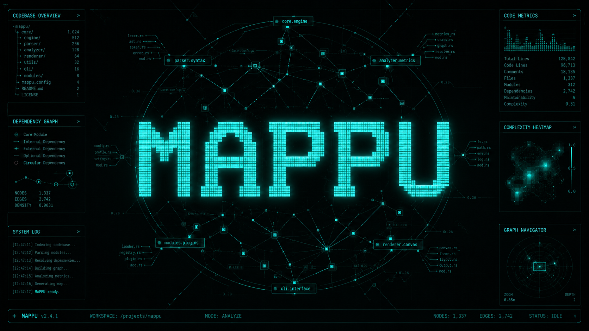

<div align="center">
  <br />
  
  <br />
  <p><i>A modern codebase intelligence & cartography engine. For steps on generating your own stylized pixelart logo/banner using AI models, see the <a href="#-branding--banners">Branding Assets</a> section below.</i></p>
  <br />

  <p>
    <a href="https://github.com/RealCkg/mappu/stargazers">
      
    </a>
    <a href="https://github.com/RealCkg/mappu/blob/main/LICENSE">
      
    </a>
    
    
    
  </p>

  <h3>Open-source code intelligence framework.<br/>Static analysis first. AI as a layer on top.</h3>

  <p>
    <a href="#-install">Install</a> ·
    <a href="#-commands">Commands</a> ·
    <a href="#-architecture">Architecture</a> ·
    <a href="#-ai-layer">AI Layer</a> ·
    <a href="#-config">Config</a> ·
    <a href="#-library">Use as Library</a>
  </p>
</div>

---

## What is Mappu?

Mappu is a **code intelligence engine** — not a linter, not a scanner, not an AI wrapper. It builds a rich semantic index of your codebase (call graphs, import graphs, symbol tables, complexity metrics, community clusters) and exposes that index through a CLI, a REST API, a web UI, and an optional AI reasoning layer.

The core principle that separates Mappu from every other tool:

> Other tools send raw code to AI and hope. Mappu builds a knowledge graph first, then AI reasons over structured facts.

Works offline. Works on any language. Works on any codebase size. AI is optional.

---

## ⚡ Install

```bash
npm install -g mappu
```

Or run without installing:

```bash
npx mappu init
```

---

## 🚀 Quick Start

```bash
# Index your project (no AI, no network, instant)
mappu init

# Search by developer intent
mappu search "where auth tokens are validated"

# Trace execution from any entry point
mappu trace "POST /api/auth/login"

# Full code quality audit
mappu doctor

# Security scan
mappu security

# Start web UI
mappu watch --port 3000
```

---

## 📋 Commands

### Static (no AI, no network required)

| Command | What it does |
|---|---|
| `mappu init` | Index the codebase — symbols, call graph, import graph, community clusters |
| `mappu search <query>` | BM25 semantic search + AST structural pattern search |
| `mappu trace <symbol>` | Walk the real call graph — who calls what, exact file and line |
| `mappu doctor` | Code quality audit — complexity, async issues, coupling, dead exports |
| `mappu map` | Render the import or call graph as Mermaid/DOT |
| `mappu dead` | Find unreachable code via reachability analysis from entry points |
| `mappu clone` | Detect duplicate code blocks — exact and structural clones |
| `mappu security` | SAST rules, secrets, IaC misconfigs, AI supply chain threats |
| `mappu git hotspots` | Files ranked by complexity × commit frequency |
| `mappu git cochange` | Files that always change together (hidden coupling) |
| `mappu xref <symbol>` | Full cross-reference — callers, callees, importers |
| `mappu api` | Extract all API endpoints without running the app |
| `mappu deps` | Dependency inventory, CVE scan, SBOM generation |
| `mappu stats` | Codebase metrics — lines, functions, avg complexity, clusters |
| `mappu watch` | Re-index on file changes + serve web UI |

### AI Layer (optional, requires API key)

| Command | What it does |
|---|---|
| `mappu ask "<question>"` | Ask anything about the codebase — answers grounded in real index data |
| `mappu chat` | Interactive multi-turn REPL with full codebase context |
| `mappu review [file]` | AI code review built on top of static findings |
| `mappu refactor "<goal>"` | Generate actual code diffs, not just a plan |
| `mappu onboard` | Auto-generate onboarding documentation from the index |
| `mappu commit` | Analyze staged changes + suggest commit message + impact |

Add `--ai` to any static command for AI explanation on top:

```bash
mappu doctor --ai          # explains findings and prioritizes them
mappu trace login --ai     # narrates the call chain in plain English
mappu security --ai        # explains each vulnerability and attack scenario
```

---

## 🏗️ Architecture

```
┌─────────────────────────────────────────────────────┐
│                   INTERFACES                         │
│        CLI  ·  REST API  ·  Web UI  ·  AI Agent      │
└─────────────────────┬───────────────────────────────┘
                      │
┌─────────────────────▼───────────────────────────────┐
│                    ENGINES                           │
│  Search · Trace · Doctor · Map · Dead · Clone        │
│  Security · Git · XRef · API · Stats · Deps          │
└─────────────────────┬───────────────────────────────┘
                      │
┌─────────────────────▼───────────────────────────────┐
│                     INDEX                            │
│    Tree-sitter Parser · Call Graph · Import Graph    │
│    BM25 Index · Community Detection · SQLite         │
└─────────────────────────────────────────────────────┘
```

**Layer 1 — Index** (`mappu init`): Parses every file with Tree-sitter, extracts symbols/imports/calls, builds a real call graph and import graph, runs Louvain community detection, builds a BM25 search index. All stored in `.mappu/mappu.db`. Zero AI calls. Zero network requests.

**Layer 2 — Engines**: 14 analysis engines that query the SQLite index. Each engine is deterministic, offline, and composable.

**Layer 3 — Interfaces**: CLI, REST API, React web UI, and an AI agent layer that uses the engines as function-call tools.

---

## 🔍 Search Syntax

Mappu supports GitHub Code Search-style qualifiers:

```bash
# Natural language
mappu search "where payment errors are handled"

# With qualifiers
mappu search "validate token" symbol:function path:src/middleware is:async
mappu search "UserService" symbol:class is:exported
mappu search "config" complexity:>10 lines:>50

# Regex
mappu search /async.*catch/

# Structural AST patterns
mappu search --pattern "async function $NAME($PARAMS)"
mappu search --pattern "try { $_ } catch { }"        # empty catch blocks
mappu search --pattern "console.log($ANY)"
```

---

## 🔐 Security

Mappu's security layer covers four categories:

**SAST** — SQL injection, XSS, eval(), command injection, path traversal, hardcoded secrets, weak random, prototype pollution, open redirect, ReDoS.

**AI Supply Chain** — Repo poisoning detection (Clinejection, CurXecute, ToxicSkills, CamoLeak, RoguePilot, AIShellJack), prompt injection patterns, MCP server vulnerabilities, RAG pipeline risks.

**IaC** — Dockerfile, Kubernetes manifests, Terraform — checks for root containers, exposed secrets, missing resource limits, insecure configurations.

**Dependencies** — CVE scanning via OSV API, license compliance, SBOM generation (SPDX), outdated package detection.

External adapters: `--grype`, `--trivy`, `--medusa` for additional coverage.

All security findings export as SARIF for direct upload to GitHub Code Scanning.

```bash
mappu security --format sarif --output security.sarif
```

---

## 🤖 AI Layer

The AI never touches raw code. It calls static engines as function-call tools and reasons over structured facts from the index.

```
User question
    ↓
AI calls: search_symbols, trace_calls, get_findings, get_complexity...
    ↓
Static engines return real data from SQLite index
    ↓
AI reasons over structured facts
    ↓
Cited response (every claim references a real file:line)
```

Every AI response cites the exact file and line it's referencing. The AI cannot hallucinate a symbol or file path that doesn't exist in the index.

### Configure AI provider

```bash
# Gemini
mappu config set ai.provider gemini
mappu config set ai.key $GEMINI_API_KEY
mappu config set ai.model gemini-3.5-flash

# OpenAI
mappu config set ai.provider openai
mappu config set ai.key $OPENAI_API_KEY

# Anthropic
mappu config set ai.provider anthropic
mappu config set ai.key $ANTHROPIC_API_KEY

# Local / Offline (Ollama)
mappu config set ai.provider ollama
mappu config set ai.model llama3.1:8b
```

Or via environment variables:

```bash
MAPPU_AI_PROVIDER=gemini
MAPPU_AI_KEY=your-key-here
MAPPU_AI_MODEL=gemini-3.5-flash
```

---

## ⚙️ Config

`mappu.config.ts` in your project root:

```typescript
export default {
  root: './src',
  exclude: ['**/*.test.ts', '**/fixtures/**'],
  languages: ['ts', 'js', 'py'],

  doctor: {
    complexity: { threshold: 10 },
    lines: { functionMax: 50, fileMax: 400 },
    params: { max: 4 }
  },

  security: {
    fail: 'high',
    adapters: { grype: false, trivy: false, medusa: false }
  },

  ai: {
    provider: 'gemini',
    model: 'gemini-3.5-flash',
    apiKey: process.env.MAPPU_AI_KEY,
    stream: true,
    contextTokenLimit: 8000
  }
}
```

---

## 📦 Use as Library

```bash
npm install mappu
```

```typescript
import { IndexBuilder, SearchEngine, DoctorEngine } from 'mappu'

// Index a project
const builder = new IndexBuilder()
await builder.build('./my-project')

// Search
const search = new SearchEngine()
const results = await search.run({
  query: 'auth token validation',
  limit: 10
})

// Doctor
const doctor = new DoctorEngine()
const report = await doctor.run({ severity: 'high' })
```

---

## 🌐 Supported Languages

| Language | Parsing | Call Graph | Type Analysis |
|---|---|---|---|
| TypeScript | ✅ | ✅ | ✅ |
| JavaScript | ✅ | ✅ | — |
| Python | ✅ | ✅ | — |
| Rust | ✅ | ✅ | — |
| Go | ✅ | ✅ | — |
| Java | ✅ | ✅ | — |
| C/C++ | ✅ | ✅ | — |
| C# | ✅ | ✅ | — |
| Ruby | ✅ | — | — |
| PHP | ✅ | — | — |
| Bash | ✅ | — | — |
| SQL | ✅ | — | — |

---

## 📊 Comparison

| | Copilot Chat | Cursor | SonarQube | Mappu |
|---|---|---|---|---|
| Grounded in real index | ✗ | partial | ✗ | ✅ |
| Works offline | ✗ | ✗ | ✗ | ✅ |
| Call graph traversal | ✗ | ✗ | partial | ✅ |
| AI supply chain security | ✗ | ✗ | ✗ | ✅ |
| Provider agnostic AI | ✗ | ✗ | ✗ | ✅ |
| Use as library | ✗ | ✗ | ✗ | ✅ |
| Open source | ✗ | ✗ | partial | ✅ |
| Free core | ✗ | partial | partial | ✅ |

---

## 🎨 Branding & Banners

If you want to generate a highly polished, stylized version of the "MAPPU" CLI pixel/ASCII art to serve as your custom banner or repository logo, we have optimized high-density prompt templates below for use with generative models like **Midjourney v6**, **DALL-E 3**, or **Stable Diffusion (Flux/SD3)**.

### 🌟 The Pixel/Mappu Tech Banner Prompt:
> **Prompt:** A professional widescreen technology banner. In the center, the word "MAPPU" is spelled out in bold, sharp, retro-style pixelated lettering, inspired by classic 8-bit aesthetic and terminal block-ascii layouts. The lettering is illuminated by glowing neon cybersecurity teal and electric turquoise light. The background is a sleek, ultra-dark slate terminal interface displaying faint, glowing abstract software dependency graphs, circular nodes of a codebase map, and futuristic cyber-cartography details. High-contrast, clean minimalist composition, sharp graphic design, tech-art style, shot in 8k resolution, cinematic technical lighting, cinematic noir --ar 16:9

### 🎛️ How to Fine-Tune the Output:
- **Style:** Request "Retro-computing", "ANSI text art style", "Clean digital block logo", "Isometic voxels", or "Chiptune hardware interface aesthetic".
- **Color Accent:** Blend deep greys `#1a1b26` or `#0d1117` with vibrant highlights like `#38bdf8` (sky), `#2dd4bf` (teal), or `#a855f7` (purple) to match your CLI setup.
- **Background density:** Keep the contrast high and backgrounds highly clean so the glowing typography stands out effortlessly without visual clutter.

---

## 🤝 Contributing

```bash
git clone https://github.com/RealCkg/mappu
cd mappu
npm install
npm run dev
```

See [CONTRIBUTING.md](./CONTRIBUTING.md) for the full guide.

---

## 📄 License

MIT — see [LICENSE](./LICENSE).

---

<div align="center">
  <sub>Built by <a href="https://github.com/RealCkg">RealCkg</a> · Star ⭐ if Mappu helps you</sub>
</div>
